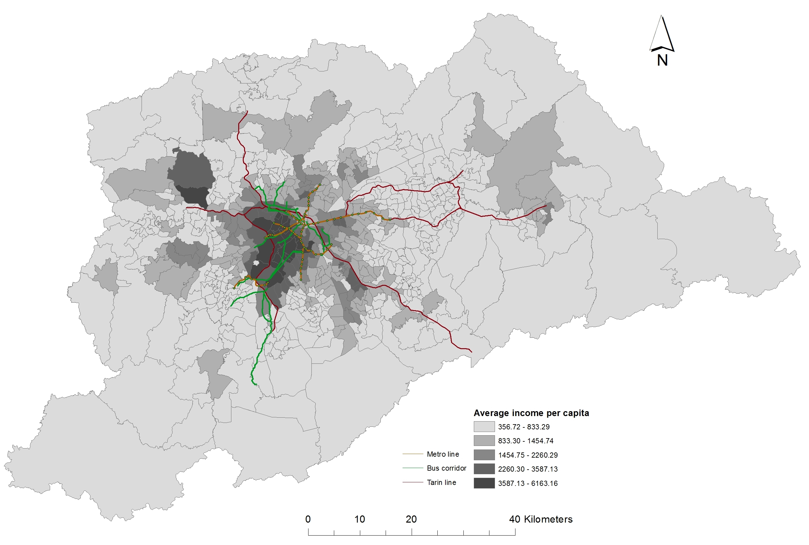
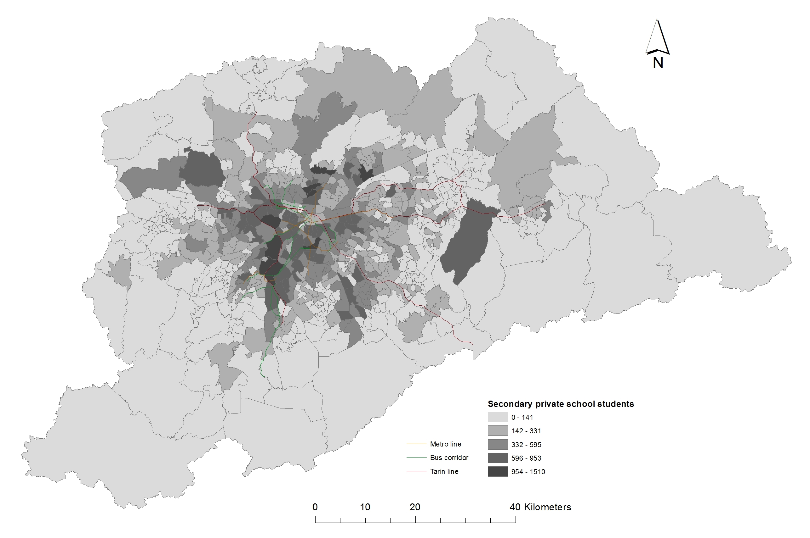
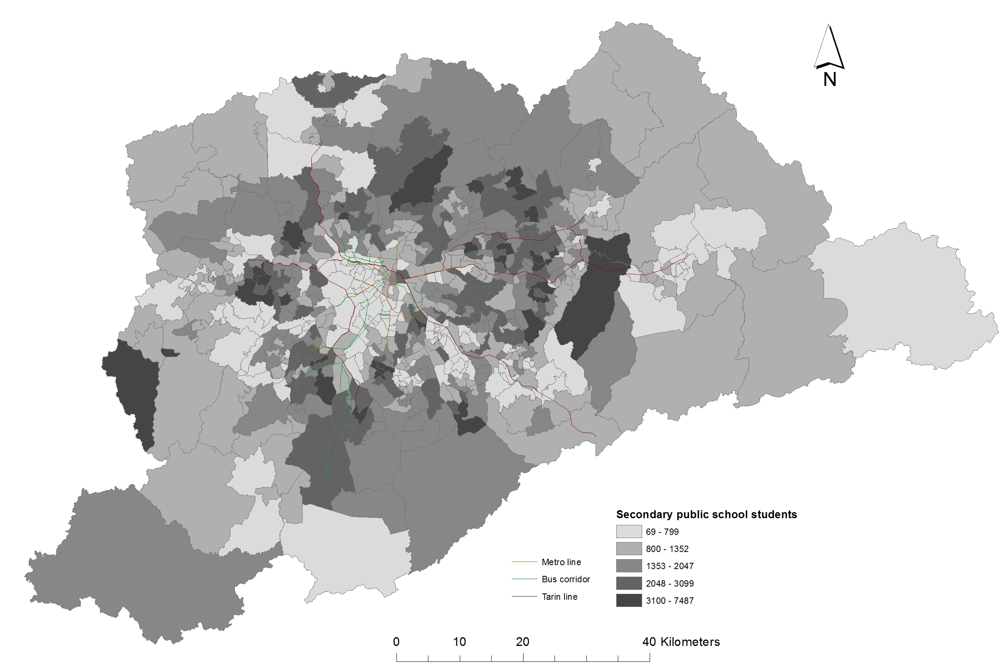
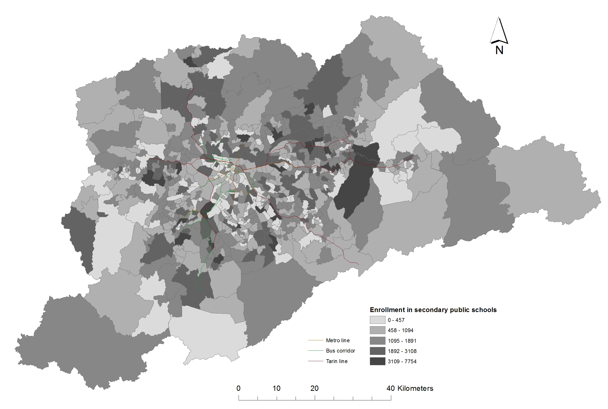

```{r, echo=FALSE}
#date: '`r format(Sys.time(), ''%F'')`'
```


# Abstract

In many large Latin American cities such as São Paulo, growing social
and economic inequalities are embedded through unfair education and
transport systems. Inequalities in educational and transport
infrastructure are mutually reinforcing: the right to mobility is
intrinsically linked to the right to education. This is manifested by
the overlap between recent protests against unwanted changes to public
education and the social movements contesting increases in public
transport fares. Another manifestation is to be found in the concept of
school accessibility. This paper sheds light on the transport-education
inequality nexus with reference to a new school accessibility measure
applied to São Paulo. By capturing both the unequal distribution of schools
and transport services across space, the index allows embedded
inequalities to be better understood and, with political will,
contested. Our index combines information on the spatial distribution of
adolescents, the location of existing schools, the travel patterns of students, and the travel infrastructure serving the school catchment area into a single measure. The index is used to measure school accessibility locally across São Paulo, using
data sources from Population and School Censuses, commonly available in
Latin American cities. The results illustrate how existing inequalities
are amplified by variable accessibility to schools across income groups
and geographical space. We conclude that extending the concept of local
accessibility indicators to education can help to both contest and
constructively tackle embedded social inequalities.

# Introduction

Partly as a response to the pressures from the Free Pass Movement that started in March, 2013, low income public school students residing in the São Paulo Metropolitan Region gained access to a public transport subsidy in 2015. However, in October 2015, the São Paulo state government announced during a television interview that as part of a budgetary deficit reduction plan, dozens of secondary schools would be closed in 2016. The change in policy was estimated to affect over 300,000 students, many whom would be placed in schools far from their homes. As a response, in the following months students occupied over 200 schools. Protesters scored some victories: the reform was postponed for one year, and the education secretary resigned (The New York Times, 2015). 

Although this time the policy change was not carried out, in a context of high spatial inequalities in the provision of public transport and schooling, it is worth asking whether a public transport subsidy for students can compensate for the lower provision of public schools in some areas. In this paper, we propose a new school accessibility index that combines information of the place of residence of students, the spatial distribution of public schools, and public transport accessibility into a single measure. We calculate a school accessibility index for 633 areas within the SPMR and use it to simulate the impact of a policy change in the location of public secondary schools, in order to, first, understand the extent of spatial inequalities in school accessibility by public transport, and second, estimate the effect of a policy aiming at concentrating public secondary education provision on school accessibility. We find that closing down schools in areas with lower than average provision is highly regressive: it negatively impacts students with the lowest accessibility levels, accentuating existing inequalities. (INCLUDE SOMETHING ABOUT CONTESTATION)

The new index we propose here constitutes a methodological contribution to the measurement of  school accessibility. It is inspired by the index developed by Shen (1998) in the context of job accessibility. The main innovative element with respect to previous proposed measures of school accessibility is that it takes into account both the 'supply' and 'demand' of students in each area. Concretely, it is based on the idea that in each local area, there is a certain amount of students in (secondary) school age, and a certain quantity of (public) school seats available. As areas are part of a city, each local area is also subject to the inflow of potential students from other areas, as well of the outflow of students to other areas. The magnitude of the net flow will depend on the travel distance between all other areas and the area in question, which here we consider to be the public transport commuting time between areas. The index thus captures the fact that students compete for school seats, which are limited in number, and distributed unequally across space. 

HERE REVIEW PREVIOUS SCHOOL ACCESSIBILITY MEASURES AND EXPLAIN THEIR LIMITATIONS VIS-A-VIS OUR INDEX
--Lit review

The first well-known attempt to define accessibility quantitatively was by @ingram1971concept, which presented a range of measures related to distance (Euclidean and network), barriers and different functions representing distance decay. This early work made the distinction between accessibility indices that apply to zones or single 'desire lines':
"relative accessibility is defined as a measure of the effort of overcoming spatial separation between two points, while the integral accessibility is defined as a measure of the effort of overcoming spatial separation between a point and all other points within an area" [@allen1993accesibility].

Inequalities in educational and transport infrastructure are mutually reinforcing: the right to mobility is intrinsically linked to the right to education. This is manifested by the overlap between recent protests against unwanted changes to public education and the social movements contesting increases in public transport fares. Travel to school options are vital for ensuring a more equitable supply of educational opportunity to diverse groups. Conversely, poor accessibility to deprived area can reinforce social inequalities, with long-term implications. Based on this emerging context, this paper develops a school accessibility index for local areas.

References transport and social exclusion
[@jones2012] provides a general framework to understand transport-related social exclusion in emerging economies

Evidence on access inequalities in the Brazilian context [@gomide2006]

Active travel children and adolescents in the SPMR [@de2015]

Previous literature for consolidated has found that school accessibility has a significant and positive impact on graduation from upper secondary schools [@falch2013], and on post-compulsory education enrolment [@dickerson2012]. For emerging economies, [@asahi2014] finds that improved metro accessibility had a negative impact on student's performance as measured by test scores.  
...

# Area of study

The São Paulo Metropolitan Region (SPMR) is a large metropolis located in the South West of Brazil. It extends for over 7,700 squared kilometers and groups 38 different municipalities besides the municipality of São Paulo itself. The estimated population in 2010 was close to 19.5 million in 2010. The integrated transport system, to which users can access through an electronic card (Bilhete Único) is composed of a railway and bus network. The railway network comprises 78.4 kilometers in five subway lines and six suburban railway lines which provide less frequent and slower service than the subway. Some of the bus network operates on dedicated bus lines, which amounted to 500 km in 2015. As can be seen in Figure 1, the richer areas of the SPMR are better served by public transport, while n important number of lower income areas is under-served.      
     

```{r inc-trans, echo=FALSE, out.width="80%"}

```

Regarding the educational system, since the constitution of 1946, primary education is compulsory. In 2005, the legislation changed to increase the duration of the primary education, going from 8 to 9 years. In 2010, all regions finished the transition. In 2009, a constitutional amendment imposed compulsory education for the primary “fundamental” and secondary “médio” levels. The constitution imposes that this resolution should be 100% implemented by 2016. 

By law, the state/municipalities should guaranty the adequate provision (100% coverage of the demand). There are national and state educational funds that are distributed among the schools  according to the number of enrolled students and  existence of facilities (library , laboratories). 

The structure of the educational system is composed by both public and private schools. The public schools are divided in the following levels: Pre school – 4-5 years (municipal administration); Fundamental – 6 – 14 (municipal administration); Secondary “medio” – 15-17 (state administration) and Superior (state and federal administration).  

According to the Censo Escolar 2010, there are 10,251 schools in the SPMR, out of which      54% are public (22% state / 32% municipal) and 46% are private. Geographically, the student is assigned to the closer school or to their house or their parent’s working place. In the secondary, the student can ask for a vacancy in a different school with a justification and under the condition of the availability of vacancy. 

The municipality is responsible for the organization of the pre-school and fundamental level. Poorer municipalities in SPMR have, in general, lower quality in terms of teachers and facilities. All the secondary schools are administrated by the state, nevertheless, differences exists depending of the location in the SPMR. In general, schools in peripheral locations show lower quality scores.  

#Data

For building our school accessibility index, we use data from three different sources. The first one is the 2008 School Census of the Brazilian National Institute of Educational Studies and Surveys (INEP), which provides information on the (universe) of public educational institutions, including a unique identifier and the number of students enrolled in secondary education. We use the coordinates contained in the database provided by the CEM (Centro de Estudos da Metrópole) for 2001 to geolocate the schools in 2008 using the unique identifier (FRED TO EXPLAIN HOW WE GEO-LOCATED THE REST). A clarification about the educational system in Brazil is in place here. Primary education \textit{ensino fundamental} comprises nine years, divided on a first year of basic literacy \textit{clase de alfabetização}, followed by eight `` series''. Primary education is mandatory for children aged 6-14. Secondary education lasts three years. In principle, the age range of secondary education students is 15-18. For each school, have geo-localized each postal address for a total of XX public primary and XX secondary schools in the SPRM. 

Our second source is information the 2010 Population Census of Brazil at the \textit{setor censitario} level, compiled and freely distributed by the Brazilian Institute of Statistics (IBGE). This spatial unit is equivalent to enumeration areas defined for surveying purposes, and contain on average 400 households. There is a total of 30,815 areas in the SPMR. IBGE also provides the digital networks containing the boundaries of the enumeration areas. From the census microdata, we have data on the number of inhabitants by age for each enumeration area. The number of adolescents in secondary school age (ages 15-18) is 1'216.611 (approximately 13 percent of the population). 

Our last source is the 2007 Origin-Destination Household Travel Survey (O-D Survey), carried out by the São Paulo Metropolitan Transport Authority Mêtro. We have information at the travel flow-level. geographic coordinates are provided for the origin and destination of each trip, as well as additional information such as trip purpose (including education), trip duration, number of transfers and mode. The O-D Survey also provides the exact location of schools. The survey also provides relevant information on individuals undertaking the trips, such as their age, income range and educational status (including student). We focus on trips made by secondary school students with an indicated motive ``education'' at the destination. The total number of trips (excluding missing values) was 11,845. Of these, 5.5 percent were multimodal. In those cases, we assign the mode of the trip leg with the largest duration. We add all trip leg durations (in minutes) to obtain the total trip duration. 

The Google Distance Matrix API was used to find the travel times and distances by public transport. This was implemented using an interface to the API, using the R package **stplanr** [@stplanr]. To provide an example of how the method works, a reproducible example is illustrated below.

```{r, message=FALSE, eval=FALSE}
library(stplanr)
o = c(-46.31813, -23.38584) # coordinates of origin
d = c(-46.34078, -23.37746) # coordinates of origin
dist_google(from = o, to = d, mode = "transit")
```

```{r, echo=FALSE, eval=FALSE}
# saveRDS(result, "result.Rds")
result = readRDS("result.Rds")
```

```
##   distances duration
## 1      2962     2118
```

The code above takes an origin (`o`) and destination (`d`) and finds the travel time and distance. This is reported as 2962 metres and 2118 seconds (35 minutes) respectively. To ensure that the result was relevant to school travel, the times were calculated for arrival time at 9am on a weekday. The function was repeated for all origin-destination pairs.

# Preliminary facts

As can be seen by comparing Figures 1, 2 and 3, students disproportionally attend private secondary schools in higher income areas, while the opposite is true for public secondary schools.




Enrolment in public secondary schools is more dispersed spatially, as in principle public schools are not clearly geographically concentrated within the region. There is, however, an important degree of variation in the school seats in each sub-area, ranging from zero to 7,754.  



Table 1 shows the model split by type of secondary school student. Clearly, secondary school students attending private schools disproportionally travel by car, compared to public school students (9% versus 47%), even though higher income areas are better served by public transport. This is in line with the findings of [@de2015]. Around 67% of public school students commute to school by active travel (mostly walking, since the percentage of biking is still relatively small), while 23% commute by public transport, which has much longer mean duration than other modes. 

```{r table-placeholder, echo=FALSE}

```


Although the mean duration of travel to school remained stable over the period 1997-2007 ([@de2015]), they could increase as a result of several factors relevant to the SPMR, including sub-urbanization of particular demographic groups, such as those with higher income; increase in the size of schools leading to an increase in school's catchment area; less than proportional increase in schools in high population growth areas with poor connectivity; and institutional changes towards more flexible school choice [@easton2015]. 

# Method: measuring school accessibility

To define school accessibility, we start by defining the broad concept of accessibility, as used in the transport literature. According to (@geurs2004, p. 128) accessibility is “the extent to which land-use and transport systems enable (groups of) individuals to reach activities or destinations by means of a (combination of) transport mode(s).” Extended to our case, school accessibility then measures the extent to which the existing built-environment and transport facilities enable children and adolescents in school age to reach schools. 

Ideally, a school accessibility measure would include information on the (almost exact) home location of every student and the location of every school they could potentially attend (as in [@andersson2012]), and some measure of commuting costs for any chosen mode (in terms of time and money). Given that this level of detail is not available in our data, we rely on area aggregates, implicitly assuming that the measure at the centroid of the area applies homogeneously within the area. A previous work studying the impact of metro expansions on test scores for Santiago de Chile measures school accessibility as the distance of every existing school to the nearest subway station [@asahi2014]. This measure implicitly assumes that most or all students commute to school by subway, which is unlike to hold for the case of the SPMR. Furthermore, this measure does not take into account the uneven distribution of students of different ages within the city. 

Given these limitations, we first consider a cumulative-opportunity measure for mode $M$ [@boisjoly2016] is defined as:

$$ CO_{i}^M= \sum_{j=1}^n(S_{j}f(C_{ij}) $$

$$ f(C_{ij}) = \left\{ 
                \begin{array}{ll}
                  1\quad if\quad C_{ij}<=t\\
                  0\quad if\quad C_{ij}<t
                \end{array}
              \right.
$$ 

This measure counts the number of schools available from one area within a certain travel time threshold by mode $M$. $C_{ij}$ is the travel cost (measured in time) between the centroid of zone $i$ and the centroid of zone $j$, and $f(C_{ij})$ is a weight function. 

This measure takes into account the spatial distribution of schooling opportunities, but not the local demand for schooling. This is particularly relevant for our analysis, since it could be the case that some areas are disproportionally served with respect to the number of potential students living within a certain travel distance. In order to assess the mismatch between the demand and supply for schooling, we use the sum of students in schools in each area (supply), and the sum of individuals within the school grade age-group living in each area (demand) in the following competitive accessibility measure, first proposed by [@shen1998location]:

$$ CA_{i}^M= \sum_{j=1}^n\frac{O_{j}f(C_{ij})}{\sum_{k=1}^n(t_{k}f(C_{kj}))}$$

Where the numerator discounts the number of "opportunities" (school seats) in area $j$ $P_{j}$ by how far area $i$ is from area $j$ using the same function as before, and the denominator discounts the number of teens in secondary school age living in zone $k$ $T_{k}$ by how far they are from area $j$. In other words, the numerator counts how many schools seats can be reached from an area, while the denominator counts how many teens can potentially reach the same area. In this way, the discounted number of school seats places at each area is divided by the potential students available to fill those places, and then summed in order to obtain a single accessibility measure for each area.  

# Results

INLCUDE MAP COMPETITIVE ACCESIBILITY INDEX BY PUBLIC TRANSPORT, INTERPRETATION OF VALUES, SENSITIVITY ANALYSIS

POLICY EXPERIMENT 
To simulate the effects of the proposed educational reform on accessibility, assign
students in areas with lower than average enrolment to the next area with higher
than average enrolment  

INCLUDE TABLE MEAN ACCESSIBILITY BEFORE AND AFTER REDISTRIBUTION, INTERPRETATION

# Discussion

# Conclusion

# References

<!--
  
  --> 

