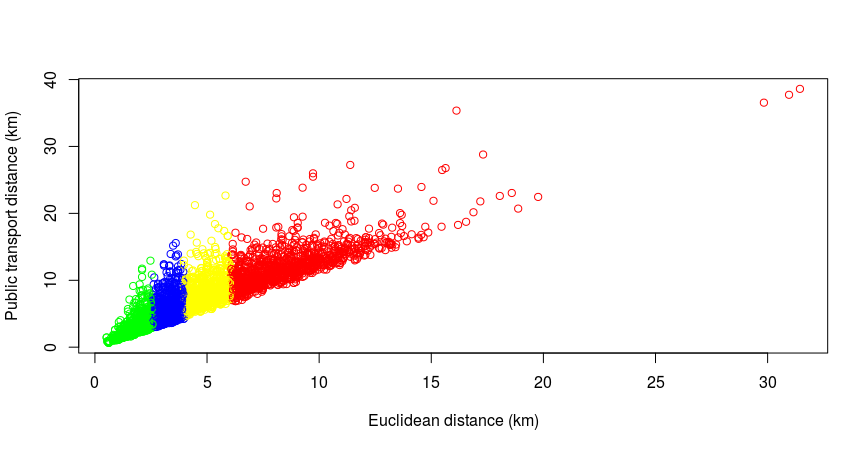

```{r, echo=FALSE}
#date: '`r format(Sys.time(), ''%F'')`'
```


# Abstract

In many large Latin American urban areas such as the São Paulo Metropolitan Region (SPMR), growing social
and economic inequalities are embedded through unfair education and
transport systems. This paper sheds light on the transport-education
inequality nexus with reference to a new school accessibility measure
applied to the SPMR. Our index combines information on the spatial distribution of
adolescents, the location of existing schools, and the travel infrastructure serving the school catchment area into a single measure. The index is used to measure school accessibility locally across 633 areas within the SPMR. The results illustrate how existing inequalities
are amplified by variable accessibility to schools across income groups
and geographical space. 


# Introduction

Inequalities in educational and transport infrastructure are mutually reinforcing: the right to mobility is intrinsically linked to the right to education. Travel to school options are vital for ensuring a more equitable supply of educational opportunity to diverse groups. Conversely, poor accessibility to deprived area can reinforce social inequalities, with long-term implications. Against this background, in this paper we propose a new way to measure school accessibility in local areas within an urban area, and ply it for the case of the São Paulo Metropolitan Region (SPMR).

The SPMR presents an excellent opportunity to measure the extent of educational and transport infrastructure, and to study the impact of public policies on different socio-economic groups. Partly as a response to the pressures from the Free Pass Movement that started in March, 2013, low income public school students residing in the SPMR gained access to a public transport subsidy in 2015. However, in October 2015, the São Paulo state government announced during a television interview that as part of a budgetary deficit reduction plan, dozens of secondary schools would be closed in 2016. The change in policy was estimated to affect more than 300,000 students, many whom would be placed in schools far from their homes. As a response, in the following months students occupied over 200 schools. Protesters scored some victories: the reform was postponed for one year, and the education secretary resigned (The New York Times, 2015). 

Although this time the policy change was not carried out, in a context of high spatial inequalities in the provision of public transport and schooling, it is worth asking whether a public transport subsidy for students can compensate for the lower provision of public schools in some areas. In this dynamic and highly political context, new quantitative evidence can help shed light on the relationship between transport and educational inequalities and the extent to which they are mutually reinforcing. Moreover, the results should help design policies that are more inclusive and equitable by highlighting areas where the provision of schools, travel to school opportunities, or both, are particularly restrictive.

Our proposed competitive accessibility measure combines information about the place of residence of students, the spatial distribution of public schools, and public transport accessibility into a single measure. We start from a cumulative opportunity measure that counts the number of schools seats that can be reached within a 30 minute journey by public transport, and then build a competitive measure that takes into account the place of residency of teens. Travel-to-school times by public transport are based on actual commuting times obtained through the Google Travel Distance API. We calculate these measures for 633 areas within the SPMR. We use the competitive measure to simulate the impact of a policy change in the location of public secondary schools, in order to, first, understand the extent of spatial inequalities in school accessibility by public transport, and second, estimate the effect of a policy aiming at concentrating public secondary education provision on school accessibility. We find that closing down schools in areas with lower than average provision is highly regressive: it negatively impacts students with the lowest accessibility levels, accentuating existing inequalities.

The first well-known attempt to define accessibility quantitatively was by @ingram1971concept, which presented a range of measures related to distance (Euclidean and network), barriers and different functions representing distance decay. This early work made the distinction between accessibility indices that apply to zones or single 'desire lines': "relative accessibility is defined as a measure of the effort of overcoming spatial separation between two points, while the integral accessibility is defined as a measure of the effort of overcoming spatial separation between a point and all other points within an area" [@allen1993accesibility]. In subsequent works, the measurement of job accessibility by particular transport modes has received vast attention in the literature [@geurs2004], while studies on access to education has largely focused on the consequences of mode choice on socio-economic indicators and school outcomes (see for instance @asahi2014, @falch2013 and @dickerson2012 on the impact of accessibility on school outcomes, and @andersson2012 and @easton2015 on the effect of changes in travel-to-school patterns in developed economies). 

Our index is inspired by the index developed by @shen1998location in the context of job accessibility. The main innovative element with respect to previous proposed measures of school accessibility is that it takes into account both the 'supply' and 'demand' for schooling in each area. Concretely, it is based on the idea that in each local area, there is a certain amount of students in (secondary) school age, and a certain quantity of (public) school seats available. As areas are part of a city, each local area is also subject to the inflow of potential students from other areas, as well of the outflow of students to other areas. The magnitude of the net flow will depend on the travel distance between all other areas and the area in question, which here we consider to be the public transport commuting time between areas. The index thus captures the fact that students compete for school seats, which are limited in number, and distributed unequally across space. The inclusion of this competitive element to school accessibility, akin to that in job access, highlights the fact that under certain educational systems, the access to opportunities is mediated by competition.  

Our work contributes to the literature on transport-related social exclusion in emerging economies [@jones2012] by providing a quantitative way to assess multiple dimensions into a single measure. It also provides a benchmark to compare access inequalities in countries with unequal provision of public services [@gomide2006], [@pacione1989access]. Considering conestation as the process through which social groups mobilize in an organized way in order to impede the implementation of unwanted policies, or force the negotiation of new conditions, our index allows embedded inequalities to be better understood. 

# Area of study

The São Paulo Metropolitan Region (SPMR) is a large metropolis located in the South West of Brazil. It extends for over 7,700 squared kilometers and groups 38 different municipalities besides the municipality of São Paulo itself. The estimated population in 2010 was close to 19.5 million in 2010. The integrated transport system, to which users can access through an electronic card (Bilhete Único) is composed of a railway and bus network. The railway network comprises 78.4 kilometers in five subway lines and six suburban railway lines which provide less frequent and slower service than the subway. Some of the bus network operates on dedicated bus lines, which amounted to 500 km in 2015. As can be seen in Figure 1, the richer areas of the SPMR are better served by public transport, while n important number of lower income areas is under-served.      
     
```{r inc-trans, echo=FALSE, out.width="80%", fig.cap="Public transport system and income per capita in São Paulo, 2010."}
knitr::include_graphics("income_pc.png")
```

Regarding the educational system, since the constitution of 1946, primary education is compulsory. In 2005, the legislation changed to increase the duration of the primary education, going from eight to nine years. In 2010, all regions finished the transition. In 2009, a constitutional amendment imposed compulsory education for the primary and secondary levels. The constitution imposes that this resolution should be 100% implemented by 2016. By law, the state/municipalities should guaranty the adequate provision (100% coverage of the demand). There are national and state educational funds that are distributed among the schools according to the number of enrolled students and  existence of facilities (library, laboratories, etc.). 

The structure of the educational system is composed by both public and private schools. The public schools are divided in the following levels: Pre school (\textit{clase de alfabetização}) – 4-5 years (municipal administration); Fundamental (\textit{ensino fundamental}) – 6 – 14 (municipal administration); Secondary (\textit{ensino médio}) – 15-17 (state administration) and Post-secondary (\textit{ensino superior}) (state and federal administration).  

According to the Censo Escolar 2010, there are 10,251 schools in the SPMR, out of which  54% are public (22% state / 32% municipal) and 46% are private. Geographically, students are assigned to the closest school to their place of residency or their parent’s working place. For secondary school, the student can ask for a vacancy in a different school after providing a valid justification and under the condition of the availability of vacancy. 

The municipality is responsible for the organization of the pre-school and fundamental level. Poorer municipalities in SPMR have, in general, lower quality in terms of teachers and facilities. All the secondary schools are administrated by the state, nevertheless, differences exists depending of the location in the SPMR. In general, schools in peripheral locations show lower quality scores.  

# Data

For building our school accessibility index, we use data from three different sources. The first one is the 2008 School Census of the Brazilian National Institute of Educational Studies and Surveys (INEP), which provides information on the (universe) of public educational institutions, including a unique identifier and the number of students enrolled in secondary education. We use the coordinates contained in the database provided by the CEM (Centro de Estudos da Metrópole) for 2001 to geolocate the schools in 2008 using the unique identifier (FRED TO EXPLAIN HOW WE GEO-LOCATED THE REST). For each school, we have geo-localized a total of 4,612 public schools in the SPRM. 

Our second source is information the 2010 Population Census of Brazil, compiled and freely distributed by the Brazilian Institute of Statistics (IBGE). We aggregate the data by Area de Ponderacão Espacial (AEP) areas, a spatial unit defined for surveying purposes by IBGE. There is a total of 633 areas in the SPMR. IBGE provides the digital networks containing the boundaries of these areas. From the census microdata, we have data on the number of inhabitants by age for each enumeration area. The number of adolescents in secondary school age (ages 15-18) is 1'216.611 (approximately 13 percent of the population). 

The final source of information was derived from the Google Distance Matrix API, which provided travel times and distances by public transport. This was implemented using an interface to the API by means of the R package **stplanr** [@stplanr]. To provide an example of how the method works, a reproducible example is illustrated below.

```{r, message=FALSE, eval=FALSE}
library(stplanr)
o = c(-46.31813, -23.38584) # coordinates of origin
d = c(-46.34078, -23.37746) # coordinates of destination
dist_google(from = o, to = d, mode = "transit")
```

```{r, echo=FALSE, eval=FALSE}
# saveRDS(result, "result.Rds")
result = readRDS("result.Rds")
```

```
##   distances duration
## 1      2962     2118
```

The code above takes an origin (`o`) and destination (`d`) and finds the travel time and distance. This is reported as 2962 metres and 2118 seconds (35 minutes) respectively. To ensure that the result was relevant to school travel, the times were calculated for arrival time at 9am on a weekday. The function was repeated for all origin-destination pairs. To ensure the correct OD data was being generated, the results were plotted on an interactive map (Figure 1). The results show the high variability of route distance vs Euclidean distance ('circuity'), providing further evidence of inequalities in public transport provision in the city (Figure 2).

```{r , echo=FALSE, fig.cap="Visual representation of the 12,697 OD pairs routed through the Google Distance Matrix API on an interactive map in RStudio, an open source data analysis platform.", out.width="100%"}
knitr::include_graphics("od-map.png")
```

```{r euclid, echo=FALSE, fig.cap="Euclidean (straight line) vs public transport distances resulting from routing the 12,697 OD pairs of interest through the Google Distance Matrix API.", out.width="100%"}

```


# Preliminary findings

In this section we discuss a set of results that serve as motivation for the implementation of our index. We start by comparing the spatial distribution of public and private secondary school attendance. As can be seen by comparing Figures 4 and 5, with Figure 1, students in the SPMR disproportionally attend private secondary schools in higher income areas, while the opposite is true for public secondary schools.

```{r, echo=FALSE, fig.cap="The home location of students attending public secondary schools students in the SPMR.", out.width="70%"}
knitr::include_graphics(c("med_pu.png"))
``` 

```{r, echo=FALSE, fig.cap="The home location of students attending private secondary schools students in the SPMR.", out.width="70%"}
knitr::include_graphics(c("med_pr.png"))
``` 

Enrolment in public secondary schools is more dispersed spatially, as in principle public schools are not clearly geographically concentrated within the region. There is, however, an important degree of variation in the school seats in each sub-area, ranging from zero to 7,754.  

```{r, echo=FALSE, fig.cap="Enrollment in public secondary schools in the SPMR.", out.width="70%"}
knitr::include_graphics(c("enrol.png"))
``` 

Table 1 shows the model split by type of secondary school student.^[The source of this information is the 2007 Origin-Destination Household Travel Survey (O-D Survey), carried out by the São Paulo Metropolitan Transport Authority Mêtro. We focus on trips made by secondary school students with an indicated motive ``education'' at the destination. The total number of trips (excluding missing values) was 11,845. Of these, 5.5 percent were multimodal. In those cases, we assign the mode of the trip leg with the largest duration. We add all trip leg durations (in minutes) to obtain the total trip duration.]
Clearly, secondary school students attending private schools disproportionally travel by car, compared to public school students (9% versus 47%), even though higher income areas are better served by public transport. This is in line with the findings of @de2015. Around 67% of public school students commute to school by active travel (mostly walking, since the percentage of biking is still relatively small), while 23% commute by public transport, which has much longer mean duration than other modes. 

```{r table-placeholder, echo=FALSE, warning=FALSE}
# tbl = read.csv("public.csv")
# names(tbl) = c("Mode", "Percent", "Duration (min)")
# knitr::kable(tbl, row.names = T, caption = "Modal split by type of secondary school")
```

Although the mean duration of travel to school remained stable over the period 1997-2007 [@de2015], they could increase as a result of several factors relevant to the SPMR, including sub-urbanization of particular demographic groups, such as those with higher income; increase in the size of schools leading to an increase in school's catchment area; less than proportional increase in schools in high population growth areas with poor connectivity; and institutional changes towards more flexible school choice [@easton2015]. 

\newpage

# Method: measuring school accessibility

To define school accessibility, we start with the broad concept of accessibility, as used in the transport literature. According to @geurs2004 (p. 128) accessibility is “the extent to which land-use and transport systems enable (groups of) individuals to reach activities or destinations by means of a (combination of) transport mode(s).” Extended to our case, school accessibility then measures the extent to which the existing built-environment and transport facilities enable children and adolescents in school age to reach schools. 

Ideally, a school accessibility measure would include information on the home location of every student and the location of every school they could potentially attend (as in @andersson2012), and some measure of commuting costs for any chosen mode (in terms of time and money). Given that this level of detail is not available in our data, we rely on area aggregates, implicitly assuming that the measure at the centroid of the area applies homogeneously within the area. 

A previous work studying the impact of metro expansions on test scores for Santiago de Chile measures school accessibility as the distance of every existing school to the nearest subway station [@asahi2014]. This measure implicitly assumes that most or all students commute to school by subway, which is unlike to hold for the case of the SPMR. Furthermore, this measure does not take into account the uneven distribution of students of different ages within the city. 

Given these limitations, we first consider a cumulative-opportunity measure for mode $M$ [@boisjoly2016] is defined as:

$$ CO_{i}^M= \sum_{j=1}^n(O_{j}f(C_{ij}) $$

$$ f(C_{ij}) = \left\{ 
                \begin{array}{ll}
                  1\quad if\quad C_{ij}<=t\\
                  0\quad if\quad C_{ij}<t
                \end{array}
              \right.
$$ 

This measure counts the number of "opportunities" $O$, in our case schools available, from one area within a certain travel time threshold by mode $M$. $C_{ij}$ is the travel cost (measured in time) between the centroid of zone $i$ and the centroid of zone $j$, and $f(C_{ij})$ is a weight function. 

This measure takes into account the spatial distribution of schooling opportunities, but not the local demand for schooling. This is particularly relevant for our analysis, since it could be the case that some areas are disproportionally served with respect to the number of potential students living within a certain travel distance. In order to assess the mismatch between the demand and supply for schooling, we use the sum of students in schools in each area (supply), and the sum of individuals within the school grade age-group living in each area (demand) in the following competitive accessibility measure, first proposed by @shen1998location:

$$ CA_{i}^M= \sum_{j=1}^n\frac{O_{j}f(C_{ij})}{\sum_{k=1}^n(T_{k}f(C_{kj}))}$$

Where the numerator discounts the number of school seats in area $j$ $O_{j}$ by how far area $i$ is from area $j$ using the same function as before, and the denominator discounts the number of teens in secondary school age living in zone $k$ $T_{k}$ by how far they are from area $j$. In other words, the numerator counts how many schools seats can be reached from an area, while the denominator counts how many teens can potentially reach the same area. In this way, the discounted number of school seats places at each area is divided by the potential students available to fill those places, and then summed in order to obtain a single accessibility measure for each area. 

We calculate both measures for commutes to school by public transport. We set a threshold of 30 minutes based on the mean average travel times by this mode (see Table 1). We assign a minimum time of zero for commutes within the same area (i.e., schools within the same area are added to the index in all cases). 

# Results

Figure XX shows the spatial distribution of the cumulative-opportunity measure. The index has a mean value of 3,777, which indicates that for teens residing in the average area, there are 3,777 school seats that can be reached within a journey by public transport of up to 30 minutes. The standard deviation is 3,485 indicates large variation in the level of accessibility across areas. As can be seen on the Figure XX, areas with low accessibility include not only the expaded financial business district located on the central south west area, where there are not many teens or schools to start with (see Figures XX and XX), but also areas with deficient public transport provision, such as some north and south eastern areas.           

```{r, echo=FALSE, fig.cap="Cumulative opportunity index", out.width="70%"}
# knitr::include_graphics(c("cum_index.png"))
``` 

Figure XX shows the spatial distribution of the competitive accessibility measure. Although it largely follows the distribution of the cumulative index, it corrects the value in some areas based on the place of residence of students across the SPRM. To interpret the value of the index, recall that if all students in an area attended secondary schools in public secondary schools in their area (i.e., no student would travel outside her own area to attend school), the index would take the value of 1. Then, in areas with a value lower than one, the provision of public schools and public transport is such that there is local under-provision, in the sense that the number of schools seats that can be reached from the area is smaller than the number of teens that can potentially reach the area (the opposite is true for values higher than one). Note that some relatively close by areas, especially in the eastern part of the city, have striking differences in the level of accessibility. In some cases, an area can have twice the level of accessibility than the most proximate area. This can be due to differences in the local provision of public schools, public transport or the number of students living within the reach of the areas.   

```{r, echo=FALSE, fig.cap="Competitive accessibility index", out.width="70%"}
# knitr::include_graphics(c("comp_index.png"))
``` 

To understand the effects of changes in public school provision on school accessibility, we conduct a comparative static analysis using our competitive index. To simulate the effects of a policy that seeks to spatially concentrate students in larger public schools by closing down smaller schools, we assign students in areas with lower than average enrolment to the next area with higher than average enrolment, while keeping the distribution of teens and public transport constant. We then compare the changes in school accessibility for different quartiles before and after this change. Table XX summarizes the results.  

```{r , echo=FALSE, warning=FALSE}
tbl = read.csv("res-table.csv")
names(tbl) = c("Quantile","Pre-change", "Post-change", "Change (%)")
knitr::kable(tbl, row.names = F, caption = "Mean accessibility before and after redistribution")
```

The policy reduces further the accessibility level of areas in the first and second quantiles of accessibility. Areas in the first quantile experience an average reduction of 21% in school accessibility levels as a result of the changes in the spatial distribution of schools. In the mean time, areas that had high levels of accessibility to start with, experience an increase. The results suggest that concentrating the provision of public secondary schools accentuates the already large differences in accessibility levels across areas. 

# Conclusion and discussion

The policy experiment results suggest that a policy that concentrates the provision of public schools spatially is regressive. Young people living in areas with the lowest levels of accessibility experienced the largest negative impact from the policy, compounding issues of low local schooling provision, low access by public transport and/or high competition to access good schools. The policy would increase commuting times for students residing in areas with low accessibility. This would likely have further negative knock-on effects in terms of attendance, drop-out likelihood and performance.  

Although the simulated scenario represents a rather extreme change in the distribution of public schooling, the way in which students with different levels of accessibility are impacted remains, regardless of the level of concentration. In the absence of a public transport subsidy for school commutes, students who experience a substantial increase in travel-to-school times may be forced to change their commute mode from an active (and free of charge mode) to a paid-by mode, with the consequent increase in their monetary spent in commuting to school. The most negative effect is then felt by low-incomes students living in areas with low school accessibility, for whom the marginal increase in commuting costs represents a much larger share in their budget. 

The provision of a public transport subsidy for school commutes is unlikely to compensate students at the bottom of the income and accessibility ladder if the increase in commuting times has consequences in terms of motivation to stay in school and performance. In this sense, a “trade-off” logic where less schooling provision is compensated by public transport subsidies does not operate when existing inequalities in provision are large. 

Our study could be further extended to account for other modes of school commute, such as active travel. It would benefit from data with higher spatial resolution to capture within-area inequalities, which may be substantial but currently hidden away in area aggregates. A future extension of the index could also incorporate measures of school quality. Furthermore, it would be informative to calculate the proposed indices for other contexts and different time periods, to understand the extent to which the regressive nature of school agglomeration is a universal finding or specific to the SPMR. 

We conclude that extending the concept of local accessibility indicators to education can help to both contest and constructively tackle embedded social inequalities. Contestation can be seen as a powerful tool to prevent the implementation of regressive policies that threaten to accentuate already large disparities. Quantitative measures such as those proposed here can help demonstrate how multiple dimensions of inequality amplify inequalities, via a single interpretable measure. The methods demonstrated could be useful for policy makers and campaigners to negotiate policies with a highly sensitive social component and evident short and long-term consequences for those affected.   

# References

<!--
  
  --> 

